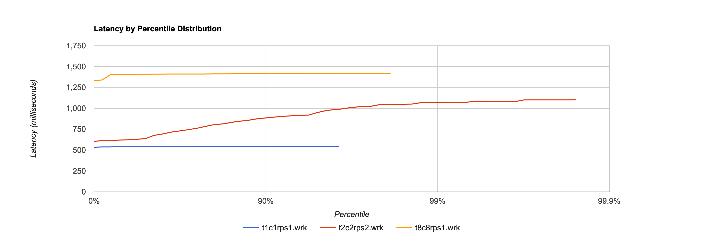
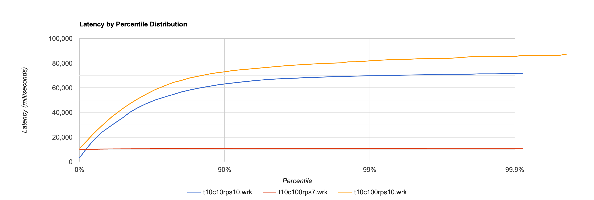
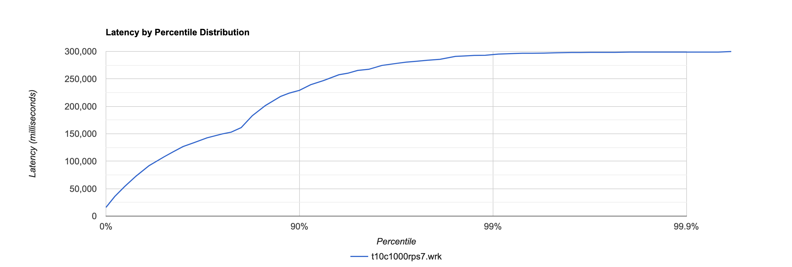
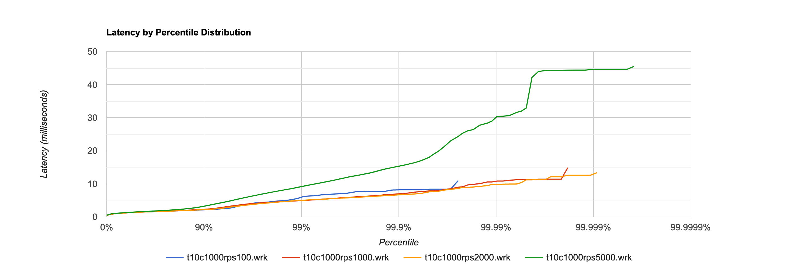
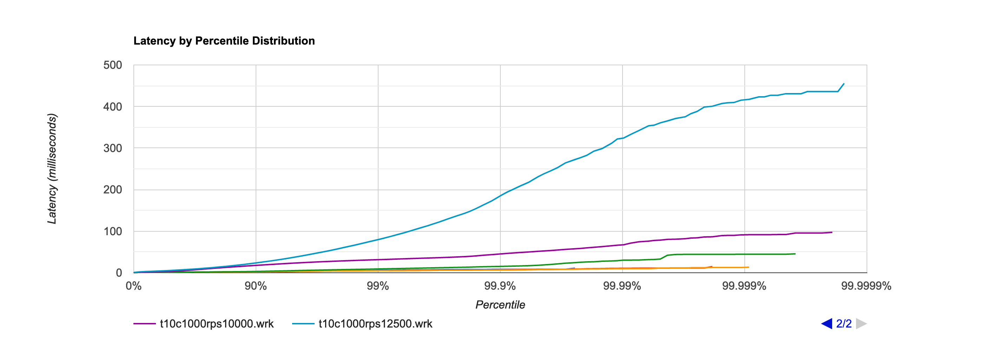
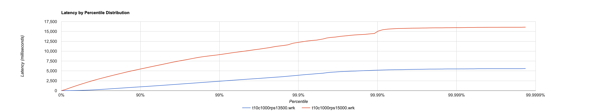
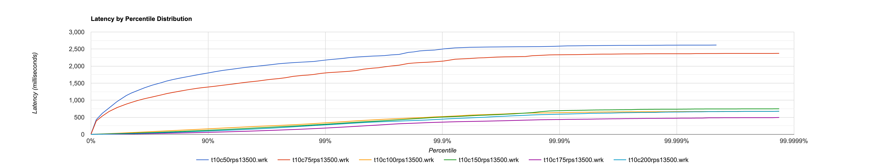

# Производительность индексов
## Описание стенда
```
Cloud: Google Cloud Platform
GCE machine-type: n2d-custom-8-10240
CPU:
	Arch: AMD EPYC Milan
	Cores: 8
RAM: 10 GiB
Storage: 20GiB SSD persistent disk
```
## Подготовка к тестированию
### Установка wrk2
Для проведения тестирования я решил использовать инструмент [wrk2](https://github.com/giltene/wrk2).
Установка включает в себя:
```bash
git clone git@github.com:giltene/wrk2.git
cd wrk2/
make
```
В зависимости от используемой платформы необходимо будет доустановить необходимые библиотеки.
### Запуск нагрузочного теста
```bash
export WRK_HOME=../wrk2/
WRK_AUTH="Bearer TOKEN" $WRK_HOME/wrk -t1 -c1 -d1m -R 1 http://localhost:8080 --latency -s loadtest/lt.lua
# Где
# -t - количество тредов
# -c - количество соединений
# -d - длительность тестирования
# -R - RPS
# --latency - вывод гистограммы latency, которые затем можно отрисовать, например с помощью http://hdrhistogram.github.io/HdrHistogram/plotFiles.html
```
## Database information
В базе данных хранится 1кк тестовых пользователей и 1 учетная запись от которой происходят все запросы.
```sql
MariaDB [social-network]> select count(*) from users;
+----------+
| count(*) |
+----------+
|  1000001 |
+----------+
1 row in set (0.841 sec)
```
## Производительность перед созданием индекса
### Explain
```sql
MariaDB [social-network]> analyze format=json select * from users where name = 'a' and surname = 'b';
{
  "query_block": {
    "select_id": 1,
    "r_loops": 1,
    "r_total_time_ms": 557.0268402,
    "table": {
      "table_name": "users",
      "access_type": "ALL",
      "r_loops": 1,
      "rows": 897874,
      "r_rows": 1000001,
      "r_table_time_ms": 497.865801,
      "r_other_time_ms": 59.15310212,
      "filtered": 100,
      "r_filtered": 0,
      "attached_condition": "users.`name` = 'a' and users.surname = 'b'"
    }
  }
}
1 row in set (0.556 sec)
```
### Минимальная производительность для первоначальной оценки
Для начала решил провести несколько тестов с небольшим кол-вом одновременных запросов и ограниченным RPS:

На рисунке выше использованы (здесь и далее ссылки на сырые данные с процентилями):
- [1 коннект и 1 RPS](../loadtest/results/before_index/t1c1rps1.wrk)
- [2 коннекта и 2 RPS](../loadtest/results/before_index/t2c2rps2.wrk)
- [8 коннектов и 1RPS](../loadtest/results/before_index/t8c8rps1.wrk)

Из графика можно уже сделать вывод что производительность довольно низкая, т.к. 1 коннект с 1 RPS даёт latency в среднем порядка 539ms. 2 соединения с 2 RPS даёт 1s latency на 90-м процентиле. 8 одновременных запросом со средним RPS 1 даёт стабильные 1400ms latency практически на всех процентилях.
### Поиск максимального RPS
Для поиска максимального RPS я планировал проверять пр-ть на запросах в степенях 10 (10,100,...), но на 10RPS в принципе и остановился. Т.к. после [10 коннектов и 10RPS](../loadtest/results/before_index/t10c10rps10.wrk) виден был максимальный RPS в районе `7.68` и неприемлемым latency (синия линия). Плюс протестировал на [100 коннектах и 7RPS](../loadtest/results/before_index/t10c100rps7.wrk)(красная линия) и [100 коннектах и 10RPS](../loadtest/results/before_index/t10c100rps10.wrk)(оранжевая линия).

В данном случае latency довольно огромный и RPS выше не имеет смысла тестировать.
### Большое число одновременных соединений
Дополнительно протестировал [1000 коннектов при 7RPS](../loadtest/results/before_index/t10c1000rps7.wrk). Выходит слишком огромная нагрузка на дисковую подсистему с многоминутными latency.

## Создание индекса
Т.к. для поиска людей в базе используется запрос вида:
```sql
SELECT id, name, surname, age, sex, city, interests FROM users WHERE name LIKE ? AND surname LIKE ? ORDER BY id ASC
```
То в данном случае создаём индекс с помощью следующего запроса:
```sql
CREATE INDEX fn_ln_idx ON users(name, surname);
```
## Производительность после создания индекса
### Explain
```sql
MariaDB [social-network]> analyze format=json select * from users where name = 'a' and surname = 'b';
{
  "query_block": {
    "select_id": 1,
    "r_loops": 1,
    "r_total_time_ms": 0.027994766,
    "table": {
      "table_name": "users",
      "access_type": "ref",
      "possible_keys": ["fn_ln_idx"],
      "key": "fn_ln_idx",
      "key_length": "516",
      "used_key_parts": ["name", "surname"],
      "ref": ["const", "const"],
      "r_loops": 1,
      "rows": 1,
      "r_rows": 0,
      "r_table_time_ms": 0.006752654,
      "r_other_time_ms": 0.01572343,
      "filtered": 100,
      "r_filtered": 100,
      "index_condition": "users.`name` = 'a' and users.surname = 'b'"
    }
  }
}
```
### Оценка оптимального RPS
Для оценки я использовал 1000 соединений как число наиболее близкое к реальному использованию. Для этого числа протестировал следующие значения RPS:
- [100RPS](../loadtest/results/after_index/t10c1000rps100.wrk)
- [1000RPS](../loadtest/results/after_index/t10c1000rps1000.wrk)
- [2000RPS](../loadtest/results/after_index/t10c1000rps2000.wrk)
- [5000RPS](../loadtest/results/after_index/t10c1000rps5000.wrk)

Результаты в виде графика:

В данном случае latency довольно низкий, даже при 5000 RPS (<=45.535ms). Поэтому решил дальше увеличивать максимальный RPS для следующих значений:
- [10000RPS](../loadtest/results/after_index/t10c1000rps10000.wrk)
- [12500RPS](../loadtest/results/after_index/t10c1000rps12500.wrk)

Изображение содержит все графики с предыдущего изображения с добавлением двух новых:


При 12500RPS latency находится в довольно высоком значении (455.679ms), поэтому решил что необходимо сильно уменьшить шаг, т.к. максимальная производительность должна быть довольно близко. Поэтому протестировал ещё 2 значения:
- [13500RPS](../loadtest/results/after_index/t10c1000rps12500.wrk)
- [15000RPS](../loadtest/results/after_index/t10c1000rps15000.wrk)

График:

В данном случае решил что тестировать более высокие RPS не представляется разумным, поэтому решил далее проводить поиск максимального RPS путём оптимизации числа одновременных запросов. Решил идти вокруг 13500RPS т.к. большая часть перцентилей находится в приемлёмом диапазоне.
### Оптимизация числа одновременных запросов
Для фиксированного числа RPS провёл нагрузочные тестирования для следующих значений коннектов:
- [50](../loadtest/results/after_index/t10c50rps13500.wrk)
- [75](../loadtest/results/after_index/t10c75rps13500.wrk)
- [100](../loadtest/results/after_index/t10c100rps13500.wrk)
- [150](../loadtest/results/after_index/t10c150rps13500.wrk)
- [175](../loadtest/results/after_index/t10c175rps13500.wrk)
- [200](../loadtest/results/after_index/t10c200rps13500.wrk)

Итоговый график:


Как видно, оптимальное значение одновременных запросов находится в районе 175, как и в целом весь диапазон `100-200`
